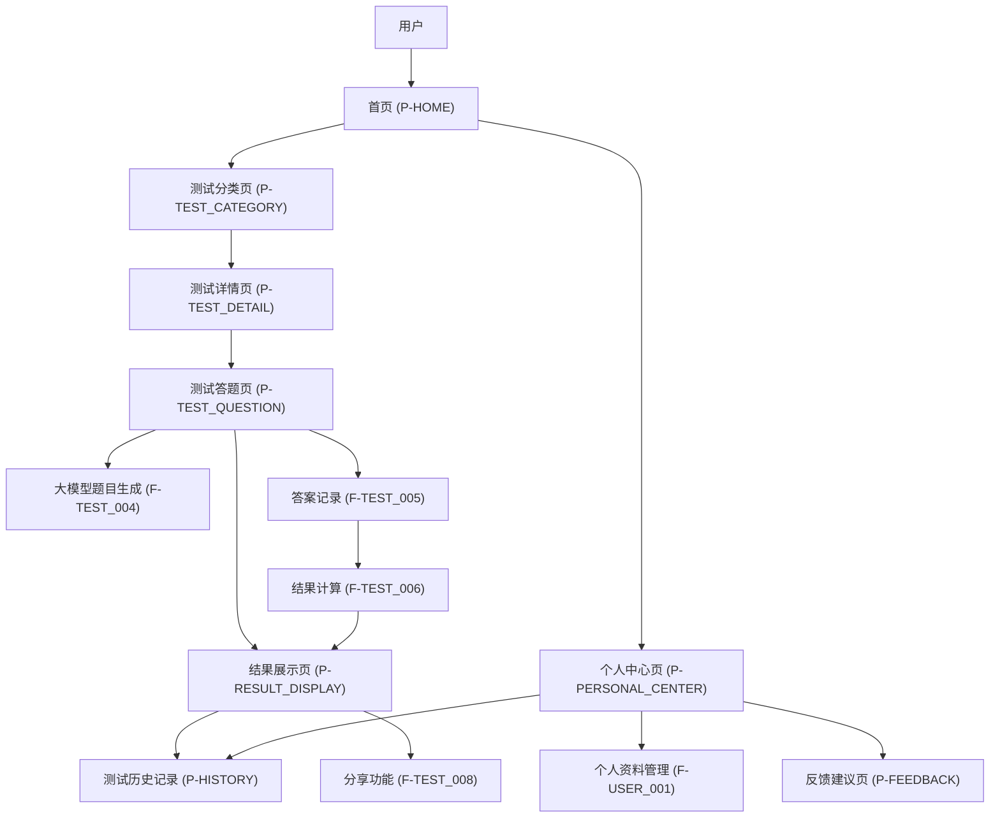
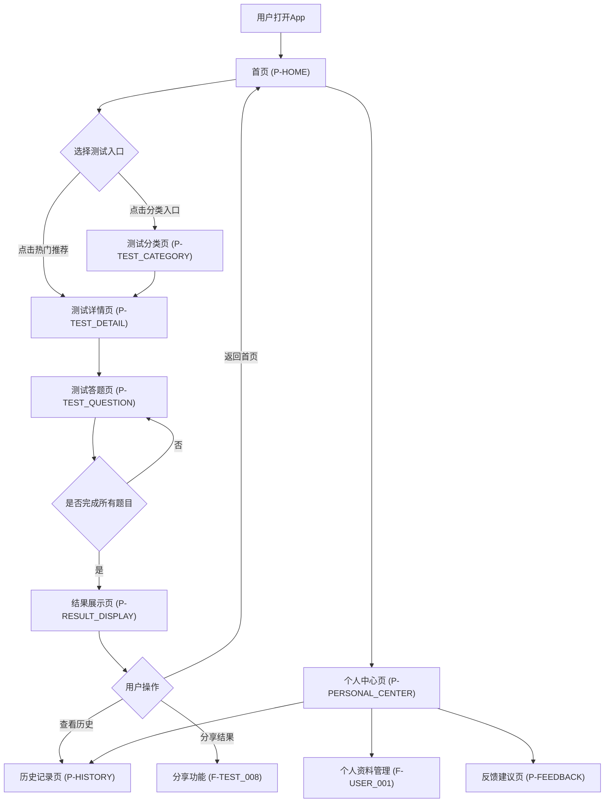
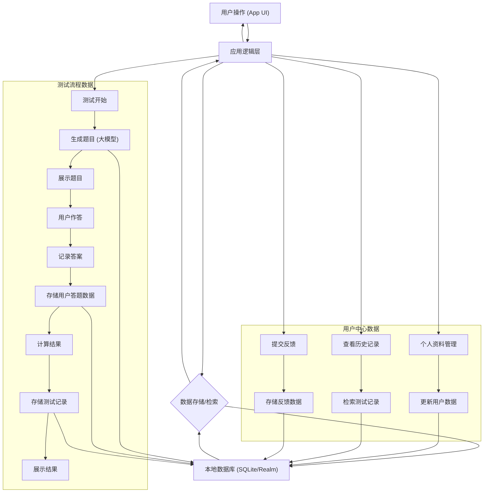

# 心探产品需求文档

## 1. 产品概述

### 1.1 产品名称与定位

*   **产品名称:** 心探
*   **产品定位:** 一款专注于提供多样化心理测试、帮助用户进行自我认知、心理评估和个人成长的移动端工具类应用。
*   **产品应用语言:** 中文

### 1.2 产品愿景与目标

*   **产品愿景:** 成为用户信赖的心理健康自我探索平台，赋能用户更好地了解自我，管理情绪，促进心理健康成长。
*   **产品目标:**
    *   提供便捷、专业的心理测试服务，满足用户自我认知和心理评估需求。
    *   通过测试结果和建议，帮助用户识别潜在心理问题，实现早期筛查。
    *   提供个性化的改善建议，支持用户的个人成长与自我提升。
    *   建立用户对自身心理健康的关注和管理习惯。

### 1.3 产品使用终端

*   **终端类型:** 移动端App (iOS & Android)

### 1.4 核心价值主张

*   **专业便捷:** 提供多种专业心理测试，随时随地进行自我评估。
*   **深度洞察:** 基于测试结果提供详细解读和个性化建议，帮助用户深入了解自我。
*   **隐私安全:** 单机应用，无需联网，确保用户数据隐私和安全。
*   **持续成长:** 支持历史测试记录对比，助力用户追踪个人成长轨迹。

### 1.5 目标用户群体分析

*   **主要用户:** 职场青年 (25-35岁)
*   **用户特征:**
    *   面临工作压力、人际关系挑战、职业发展困惑等问题。
    *   对自我认知、情绪管理、个人成长有较高需求。
    *   习惯使用移动应用获取信息和服务。
    *   注重个人隐私，倾向于在私密环境下进行心理探索。
*   **用户痛点:**
    *   缺乏便捷、专业的自我心理评估工具。
    *   对自身心理状态缺乏清晰认知，难以识别潜在问题。
    *   寻求缓解焦虑、压力的方法和个人成长路径。
    *   希望在不暴露隐私的情况下获取心理支持。

### 1.6 市场需求与竞品简析

*   **市场需求:** 随着社会节奏加快，心理健康问题日益突出，人们对自我认知、情绪管理和心理健康的关注度不断提升。对便捷、隐私、专业的心理测试和自我成长工具的需求持续增长。
*   **竞品简析:**
    *   **优势:** 市场上存在多种心理健康App，部分提供心理测试功能，或结合在线咨询、冥想等。
    *   **劣势:** 多数竞品依赖网络连接，可能涉及用户数据上传，隐私性存在隐患；部分测试内容专业性不足或结果解读过于简单。
*   **心探优势:** 作为单机应用，心探在用户隐私保护方面具有独特优势，同时通过大模型生成测试内容，确保测试的多样性和一定的专业性。

## 2. 功能规格

### 2.1 功能详述

#### 2.1.1 测试管理功能

| 功能ID | 功能名称 | 功能描述 | 优先级 |
|--------|---------|---------|--------|
| F-TEST_001 | 测试类型展示 | 在测试分类页（P-TEST_CATEGORY）展示所有支持的心理测试类型，包括智商测试、抑郁症评估、焦虑症筛查、性格测试、压力水平测试、人际关系评估、职业兴趣测试、睡眠质量评估、性心理评估。所有测试题目基于权威心理学论文、维基百科等专业资料生成，确保科学性和专业性。 | P0 |
| F-TEST_002 | 测试详情查看 | 用户点击测试类型后，进入测试详情页（P-TEST_DETAIL），展示测试简介、预计时长、题目数量等信息。 | P0 |
| F-TEST_003 | 测试开始 | 用户在测试详情页（P-TEST_DETAIL）点击“开始测试”按钮，进入测试答题页（P-TEST_QUESTION）。 | P0 |
| F-TEST_004 | 题目生成与展示 | 测试答题页（P-TEST_QUESTION）根据所选测试类型展示题目。所有题目在App发布前由大模型基于权威心理学论文、维基百科等专业资料预先生成并经过AI审核，确保科学性和专业性。题目支持单选、多选、量表等多种形式。 | P0 |
| F-TEST_005 | 题目作答与提交 | 用户在测试答题页（P-TEST_QUESTION）选择答案，点击“下一题”或“提交”按钮。系统记录用户答案。 | P0 |
| F-TEST_006 | 测试结果计算 | 测试提交后，系统根据用户答案和预设算法计算测试分数和结果。每个题目的分数映射规则在题目生成时已确定，确保评分的一致性和可靠性。 | P0 |
| F-TEST_007 | 测试结果展示 | 测试结果在结果展示页（P-RESULT_DISPLAY）呈现，包含测试分数、结果解读、改善建议和专业参考资料。测试结果基于权威心理学理论，用户答题记录可选择性地发送给大模型进行深度分析，获得个性化建议。 | P0 |
| F-TEST_008 | 测试结果分享 | 用户可在结果展示页（P-RESULT_DISPLAY）点击“分享”按钮，将测试结果分享至外部社交平台。 | P1 |

#### 2.1.2 用户中心功能

| 功能ID | 功能名称 | 功能描述 | 优先级 |
|--------|---------|---------|--------|
| F-USER_001 | 个人资料管理 | 用户可在个人中心页（P-PERSONAL_CENTER）查看和编辑个人基本信息，如昵称、头像等。 | P1 |
| F-USER_002 | 测试历史记录 | 用户可在历史记录页（P-HISTORY）查看所有已完成的测试记录，按时间倒序排列。点击记录可查看详细结果。 | P0 |
| F-USER_003 | 反馈建议提交 | 用户可在反馈建议页（P-FEEDBACK）提交使用过程中遇到的问题或改进建议。 | P1 |

#### 2.1.3 首页功能

| 功能ID | 功能名称 | 功能描述 | 优先级 |
|--------|---------|---------|--------|
| F-HOME_001 | 热门测试推荐 | 首页（P-HOME）展示当前热门或推荐的心理测试，以卡片形式呈现。 | P0 |
| F-HOME_002 | 测试分类入口 | 首页（P-HOME）提供明显的入口，引导用户进入测试分类页（P-TEST_CATEGORY）。 | P0 |

### 2.2 功能模块间的关系图

## 3. 用户流程

### 3.1 用户旅程地图

| 阶段 | 用户行为 | 心理感受 | 触点 | 系统响应 | 痛点/机会点 |
|------|----------|----------|------|----------|-------------|
| **发现与兴趣** | 看到App Store推荐/朋友推荐 | 好奇，想了解自己 | App Store、社交媒体 | 展示App功能和价值 | 如何吸引用户下载？ |
| **首次使用** | 下载并打开App | 期待，希望操作简单 | 启动页、首页（P-HOME） | 展示热门测试和分类入口 | 如何快速引导用户开始测试？ |
| **选择测试** | 浏览首页推荐或进入分类页 | 犹豫，选择困难 | 首页（P-HOME）、测试分类页（P-TEST_CATEGORY） | 清晰的分类和推荐 | 如何帮助用户找到适合的测试？ |
| **开始测试** | 点击“开始测试” | 专注，认真 | 测试详情页（P-TEST_DETAIL）、测试答题页（P-TEST_QUESTION） | 题目加载，计时（如有） | 题目是否清晰易懂？ |
| **完成测试** | 提交答案 | 紧张，期待结果 | 测试答题页（P-TEST_QUESTION） | 结果计算，跳转结果页 | 结果是否准确、有帮助？ |
| **查看结果** | 阅读分数、解读和建议 | 恍然大悟，获得启发 | 结果展示页（P-RESULT_DISPLAY） | 详细结果呈现 | 结果是否专业、个性化？ |
| **回顾与分享** | 查看历史记录，分享结果 | 满足，希望分享 | 历史记录页（P-HISTORY）、结果展示页（P-RESULT_DISPLAY） | 历史记录列表，分享选项 | 如何方便用户回顾和分享？ |
| **个人管理** | 编辑资料，提交反馈 | 参与感，希望被重视 | 个人中心页（P-PERSONAL_CENTER）、反馈建议页（P-FEEDBACK） | 资料更新，反馈提交成功 | 如何提升用户粘性？ |

### 3.2 关键路径流程图

### 3.3 各场景下的用户操作步骤

#### 3.3.1 场景一：完成一次心理测试

1.  **用户操作:** 打开心探App。
    *   **系统响应:** 进入首页（P-HOME）。
2.  **用户操作:** 在首页（P-HOME）点击“热门测试推荐”中的“抑郁症评估”卡片。
    *   **系统响应:** 跳转至抑郁症评估的测试详情页（P-TEST_DETAIL）。
3.  **用户操作:** 在测试详情页（P-TEST_DETAIL）点击“开始测试”按钮。
    *   **系统响应:** 跳转至测试答题页（P-TEST_QUESTION），加载第一道题目。
4.  **用户操作:** 阅读题目，选择答案，点击“下一题”。
    *   **系统响应:** 加载下一道题目。
5.  **用户操作:** 重复步骤4，直至完成所有题目。
6.  **用户操作:** 点击“提交”按钮。
    *   **系统响应:** 系统计算测试结果，跳转至结果展示页（P-RESULT_DISPLAY）。
7.  **用户操作:** 在结果展示页（P-RESULT_DISPLAY）阅读测试分数、结果解读、改善建议和专业参考资料。
8.  **用户操作:** 点击“分享”按钮，选择分享至微信。
    *   **系统响应:** 调用系统分享接口，分享测试结果。
9.  **用户操作:** 点击“返回首页”按钮。
    *   **系统响应:** 返回首页（P-HOME）。

#### 3.3.2 场景二：查看历史测试记录

1.  **用户操作:** 打开心探App。
    *   **系统响应:** 进入首页（P-HOME）。
2.  **用户操作:** 点击底部导航栏的“我的”图标，进入个人中心页（P-PERSONAL_CENTER）。
    *   **系统响应:** 跳转至个人中心页（P-PERSONAL_CENTER）。
3.  **用户操作:** 在个人中心页（P-PERSONAL_CENTER）点击“测试历史记录”入口。
    *   **系统响应:** 跳转至历史记录页（P-HISTORY），展示所有已完成的测试记录列表，按时间倒序排列。
4.  **用户操作:** 点击列表中某条“抑郁症评估”的记录。
    *   **系统响应:** 跳转至该次测试的结果展示页（P-RESULT_DISPLAY），显示详细结果。
5.  **用户操作:** 点击“返回”按钮。
    *   **系统响应:** 返回历史记录页（P-HISTORY）。

## 4. 数据流设计

### 4.1 数据结构与关系

*   **用户数据 (User)**
    *   `user_id` (主键)
    *   `nickname` (昵称)
    *   `avatar_url` (头像路径)
    *   `last_login_time` (最后登录时间)
*   **测试类型数据 (TestType)**
    *   `test_type_id` (主键)
    *   `test_name` (测试名称，如“抑郁症评估”)
    *   `description` (测试简介)
    *   `estimated_duration` (预计时长)
    *   `question_count` (题目数量)
    *   `category` (分类，如“心理健康”)
*   **题目数据 (Question)**
    *   `question_id` (主键)
    *   `test_type_id` (外键，关联TestType)
    *   `question_text` (题目内容)
    *   `question_type` (题目类型，如"单选"、"多选"、"量表")
    *   `options` (选项列表，JSON格式)
    *   `score_mapping` (分数映射规则，JSON格式)
    *   `source_reference` (题目来源参考，基于权威心理学论文、维基百科等)
    *   `ai审核状态` (AI审核状态，确保题目科学性)
*   **用户测试记录数据 (UserTestRecord)**
    *   `record_id` (主键)
    *   `user_id` (外键，关联User)
    *   `test_type_id` (外键，关联TestType)
    *   `start_time` (测试开始时间)
    *   `end_time` (测试结束时间)
    *   `total_score` (测试总分)
    *   `result_summary` (结果摘要)
    *   `improvement_suggestions` (改善建议)
    *   `reference_materials` (专业参考资料)
*   **用户答题数据 (UserAnswer)**
    *   `answer_id` (主键)
    *   `record_id` (外键，关联UserTestRecord)
    *   `question_id` (外键，关联Question)
    *   `user_choice` (用户选择的答案，JSON格式)
    *   `score_obtained` (该题得分)

### 4.2 关键数据流向图

### 4.3 数据存储与处理原则

*   **本地存储:** 所有用户数据、测试题目、测试记录和答题数据均存储在用户设备的本地数据库中，不上传至任何服务器，确保用户隐私安全。
*   **数据加密:** 敏感数据（如用户答题内容）在本地存储时应进行加密处理，防止未经授权的访问。用户数据仅在用户主动选择时，通过HTTPS加密传输发送给大模型进行深度分析。
*   **数据完整性:** 确保测试记录和答题数据的完整性，防止数据丢失或损坏。
*   **题目生成策略:** 采用统一的题目生成机制。所有测试题目在App发布前由大模型基于权威心理学论文、维基百科等专业资料预先生成，并经过AI审核确保科学性和专业性。
*   **结果计算:** 测试结果计算逻辑在本地完成，基于用户答题数据和预设算法进行。每个题目的分数映射规则在题目生成时已确定，确保评分的一致性和可靠性。
*   **数据备份:** 用户数据保存在本地设备上，若用户删除App，数据将永久消失。重新安装App时不会恢复之前的数据，确保用户隐私。

## 5. 页面规格

### 5.1 页面概览

| 页面ID | 页面名称 | 核心功能 |
|--------|---------|---------|
| P-HOME | 首页 | 热门测试推荐、测试分类入口 |
| P-TEST_CATEGORY | 测试分类页 | 展示所有测试类型，供用户选择 |
| P-TEST_DETAIL | 测试详情页 | 展示测试简介、预计时长、题目数量，提供开始测试入口 |
| P-TEST_QUESTION | 测试答题页 | 展示题目，收集用户答案 |
| P-RESULT_DISPLAY | 结果展示页 | 展示测试分数、结果解读、改善建议、专业参考资料，提供分享功能 |
| P-PERSONAL_CENTER | 个人中心页 | 个人资料管理、测试历史记录入口、反馈建议入口 |
| P-HISTORY | 历史记录页 | 展示用户已完成的测试记录列表 |
| P-FEEDBACK | 反馈建议页 | 提供用户提交问题和建议的表单 |

### 5.2 页面详情

#### 5.2.1 首页（P-HOME）

*   **页面名称与目的:** 首页，作为App的入口，向用户展示热门测试推荐和测试分类入口，引导用户开始使用。
*   **页面负责的核心功能:** 热门测试推荐（F-HOME_001）、测试分类入口（F-HOME_002）。
*   **主要UI元素与布局建议:**
    *   顶部导航栏：包含App名称“心探”。
    *   热门测试推荐区：以卡片形式横向滚动展示热门或推荐的测试，每张卡片包含测试名称、简介、预计时长。
    *   测试分类入口区：以图标或列表形式展示不同的测试分类（如心理健康、性格、职业发展等），点击进入测试分类页（P-TEST_CATEGORY）。
    *   底部导航栏：包含“首页”、“我的”等入口。
*   **页面需展示的关键数据:**
    *   热门测试列表：测试名称、简介、预计时长。
    *   测试分类列表：分类名称、分类图标。

#### 5.2.2 测试分类页（P-TEST_CATEGORY）

*   **页面名称与目的:** 测试分类页，集中展示所有可用的心理测试类型，方便用户按类别查找和选择。
*   **页面负责的核心功能:** 测试类型展示（F-TEST_001）。
*   **主要UI元素与布局建议:**
    *   顶部导航栏：包含页面标题“测试分类”和“返回”按钮。
    *   测试类型列表：以列表或网格形式展示所有测试类型，每个条目包含测试名称、简介、预计时长。
*   **页面需展示的关键数据:**
    *   所有测试类型列表：测试名称、简介、预计时长。

#### 5.2.3 测试详情页（P-TEST_DETAIL）

*   **页面名称与目的:** 测试详情页，展示特定测试的详细信息，并提供开始测试的入口。
*   **页面负责的核心功能:** 测试详情查看（F-TEST_002）、测试开始（F-TEST_003）。
*   **主要UI元素与布局建议:**
    *   顶部导航栏：包含页面标题（测试名称）和“返回”按钮。
    *   测试信息区：展示测试名称、详细简介、预计时长、题目数量。
    *   “开始测试”按钮：位于页面底部，醒目位置。
*   **页面需展示的关键数据:**
    *   测试名称、详细简介、预计时长、题目数量。

#### 5.2.4 测试答题页（P-TEST_QUESTION）

*   **页面名称与目的:** 测试答题页，用于展示题目并收集用户的答案。
*   **页面负责的核心功能:** 题目生成与展示（F-TEST_004）、题目作答与提交（F-TEST_005）。

**AI深度分析功能（新增）：**
*   用户完成测试后，可选择将答题记录发送给大模型进行深度分析
*   基于用户的题目选择，大模型提供个性化的自我认知建议
*   数据通过HTTPS加密传输，确保用户隐私安全
*   **主要UI元素与布局建议:**
    *   顶部导航栏：包含页面标题（测试名称）、题目进度（如“1/20”）和“返回”按钮。
    *   题目内容区：展示当前题目文本。
    *   选项区：根据题目类型展示单选框、多选框或量表滑块等。
    *   底部操作区：包含“上一题”、“下一题”或“提交”按钮。
*   **页面需展示的关键数据:**
    *   当前题目文本、选项列表。
    *   题目进度。

#### 5.2.5 结果展示页（P-RESULT_DISPLAY）

*   **页面名称与目的:** 结果展示页，向用户呈现测试的最终结果，包括分数、解读、建议和参考资料。
*   **页面负责的核心功能:** 测试结果展示（F-TEST_007）、测试结果分享（F-TEST_008）。

**专业性保障：**
*   所有测试结果基于权威心理学理论和专业资料
*   测试题目经过AI审核，确保科学性和准确性
*   改善建议基于用户的具体答题情况生成
*   **主要UI元素与布局建议:**
    *   顶部导航栏：包含页面标题（测试名称）和“返回”按钮。
    *   测试分数区：醒目展示测试总分。
    *   结果解读区：详细文字描述测试结果。
    *   改善建议区：提供个性化的行动建议。
    *   专业参考资料区：提供相关的专业知识链接或文本。
    *   底部操作区：包含“分享”按钮和“返回首页”按钮。
*   **页面需展示的关键数据:**
    *   测试分数、结果解读、改善建议、专业参考资料。

#### 5.2.6 个人中心页（P-PERSONAL_CENTER）

*   **页面名称与目的:** 个人中心页，提供用户管理个人信息、查看历史记录和提交反馈的入口。
*   **页面负责的核心功能:** 个人资料管理（F-USER_001）、测试历史记录（F-USER_002）、反馈建议提交（F-USER_003）。
*   **主要UI元素与布局建议:**
    *   顶部导航栏：包含页面标题“我的”和“返回”按钮。
    *   用户信息区：展示用户头像、昵称。
    *   功能列表区：以列表形式展示“个人资料管理”、“测试历史记录”、“反馈建议”等入口。
    *   底部导航栏：包含“首页”、“我的”等入口。
*   **页面需展示的关键数据:**
    *   用户头像、昵称。

#### 5.2.7 历史记录页（P-HISTORY）

*   **页面名称与目的:** 历史记录页，展示用户所有已完成的心理测试记录，方便用户回顾。
*   **页面负责的核心功能:** 测试历史记录（F-USER_002）。
*   **主要UI元素与布局建议:**
    *   顶部导航栏：包含页面标题“测试历史”和“返回”按钮。
    *   测试记录列表：以列表形式展示所有测试记录，每条记录包含测试名称、完成时间、简要结果（如分数）。按时间倒序排列。
*   **页面需展示的关键数据:**
    *   测试记录列表：测试名称、完成时间、测试分数。

#### 5.2.8 反馈建议页（P-FEEDBACK）

*   **页面名称与目的:** 反馈建议页，提供用户提交使用问题或改进建议的渠道。
*   **页面负责的核心功能:** 反馈建议提交（F-USER_003）。
*   **主要UI元素与布局建议:**
    *   顶部导航栏：包含页面标题“反馈建议”和“返回”按钮。
    *   反馈内容输入框：多行文本输入框，供用户输入反馈内容。
    *   联系方式输入框（可选）：单行文本输入框，供用户输入联系方式（如邮箱）。
    *   “提交”按钮：位于页面底部。
*   **页面需展示的关键数据:**
    *   无特定数据展示，主要为用户输入。

