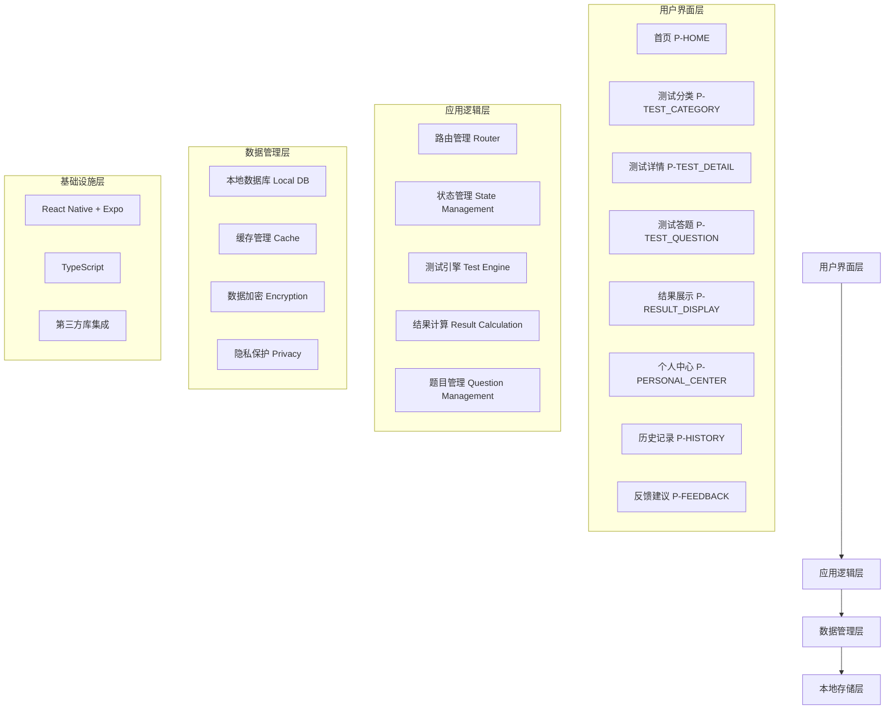
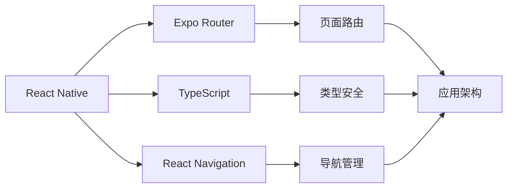

# 心探App架构设计文档

## 1. 整体架构概览

## 2. 核心架构模块

### 2.1 数据管理架构
- **状态管理**: Zustand + Context混合方案
- **本地数据库**: SQLite + TypeORM
- **缓存策略**: 内存缓存 + 磁盘缓存
- **数据流**: 单向数据流设计

### 2.2 测试题目管理架构
- **题目生成**: 大模型AI生成 + 本地缓存
- **题目存储**: 本地数据库持久化
- **题目版本**: 版本控制与管理
- **题目缓存**: 预加载与智能缓存

### 2.3 结果计算架构
- **评分引擎**: 多策略评分算法
- **智能分析**: 大模型生成建议
- **结果缓存**: 历史结果管理
- **数据标准化**: 统一结果格式

### 2.4 安全与隐私架构
- **数据加密**: AES加密敏感数据
- **本地存储**: 无服务器数据存储
- **隐私保护**: 最小化数据收集
- **安全审计**: 访问监控与日志

### 2.5 代码组织架构
- **目录结构**: 功能模块化组织
- **组件设计**: 可复用组件库
- **样式管理**: 统一样式系统
- **工具函数**: 通用工具库

## 3. 技术栈架构

## 4. 关键决策点

### 4.1 数据管理决策
- ✅ 本地存储 vs 云端存储：选择本地存储保护隐私
- ✅ 状态管理方案：Zustand vs Redux：选择Zustand
- ✅ 数据库方案：SQLite vs AsyncStorage：选择SQLite

### 4.2 题目管理决策
- ✅ 题目来源：内置 vs AI生成：选择AI生成 + 本地缓存
- ✅ 题目格式：JSON vs 数据库：选择数据库存储
- ✅ 缓存策略：内存 vs 磁盘：选择混合缓存

### 4.3 安全架构决策
- ✅ 加密方案：AES vs 其他：选择AES-256
- ✅ 隐私策略：最小化 vs 完整收集：选择最小化
- ✅ 审计方案：本地 vs 远程：选择本地审计

## 5. 架构优势

1. **隐私优先**: 所有数据本地存储，不上传服务器
2. **性能优化**: 智能缓存 + 预加载机制
3. **可扩展性**: 模块化设计，易于功能扩展
4. **安全性**: 多层加密 + 安全审计
5. **用户体验**: 流畅的交互 + 专业的心理测试

## 6. 现有架构问题分析

### 主要问题
- ❌ 数据管理架构缺失：没有统一的状态管理方案
- ❌ 测试题目管理混乱：题目数据硬编码，缺乏统一架构
- ❌ 结果计算逻辑分散：缺乏统一的评分算法
- ❌ 代码复用性差：相似组件重复实现
- ❌ 安全与隐私保护不足：缺乏数据加密机制

### 改进方向
- ✅ 建立统一的数据管理架构
- ✅ 设计智能题目生成与管理系统
- ✅ 构建标准化结果计算引擎
- ✅ 提升代码复用性和模块化
- ✅ 加强数据安全和隐私保护

## 7. 实施计划

### 阶段一：基础架构搭建
- [ ] 数据管理架构实现
- [ ] 本地数据库设计
- [ ] 状态管理集成

### 阶段二：核心功能开发
- [ ] 题目管理服务
- [ ] 结果计算引擎
- [ ] 安全加密模块

### 阶段三：优化与完善
- [ ] 性能优化
- [ ] 用户体验提升
- [ ] 测试与部署

---

*本文档为心探App的架构设计指导，后续开发需严格按照此架构进行实施。*