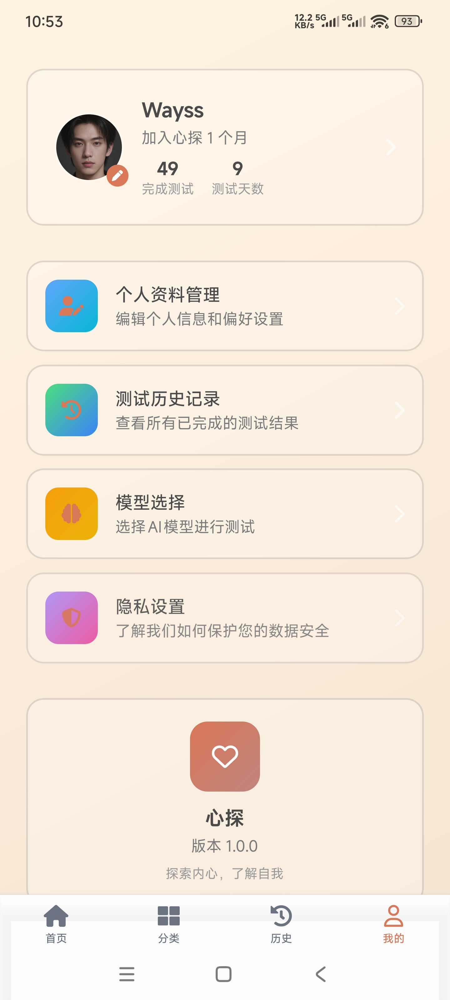
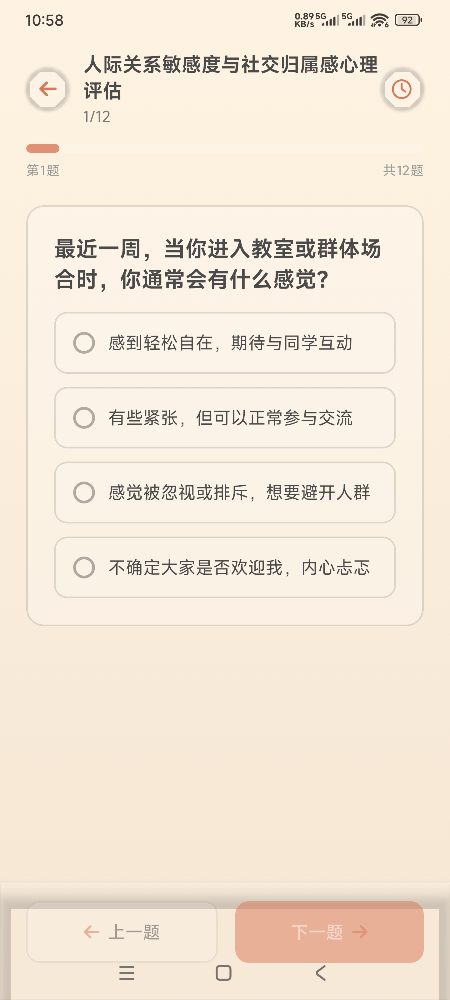
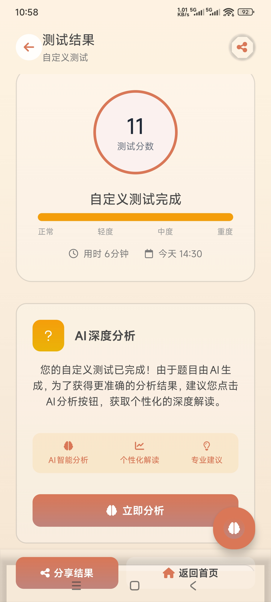
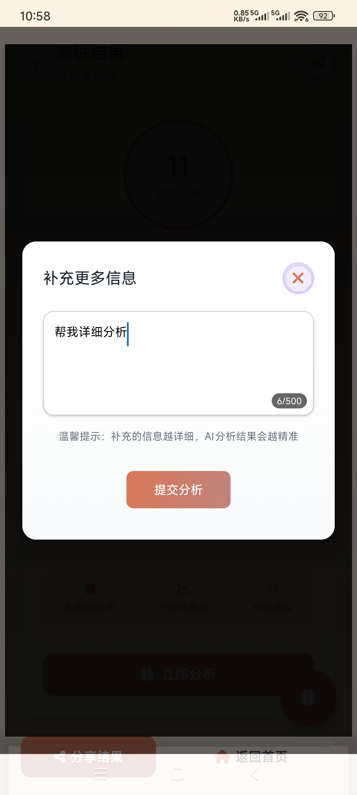
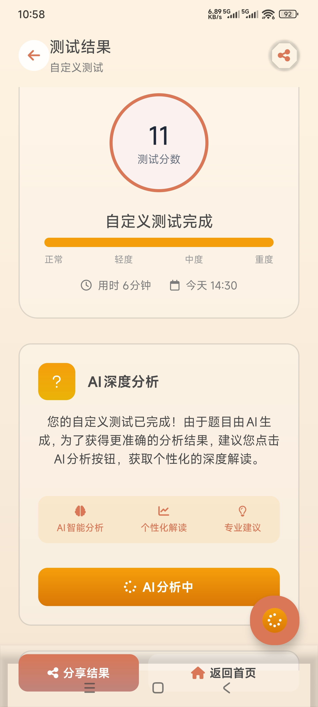
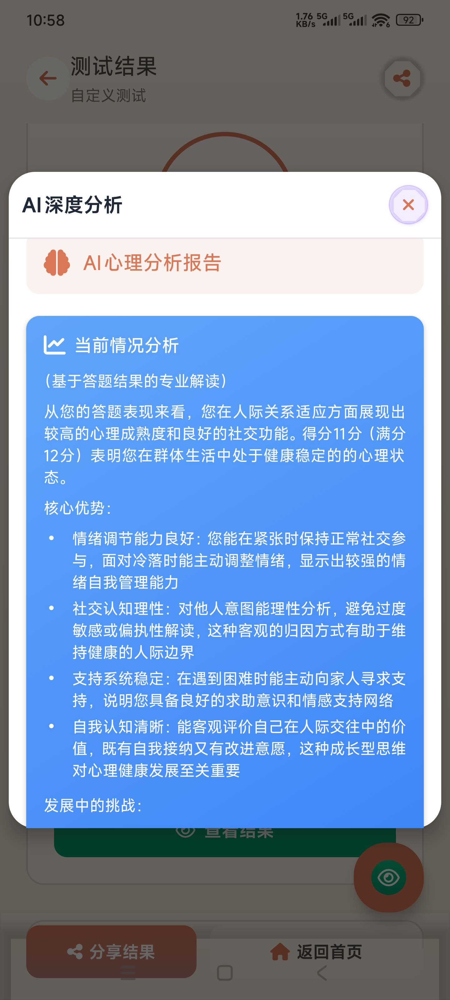
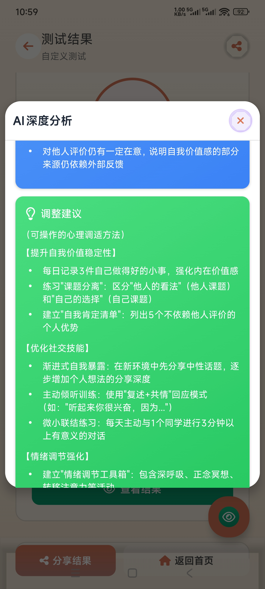
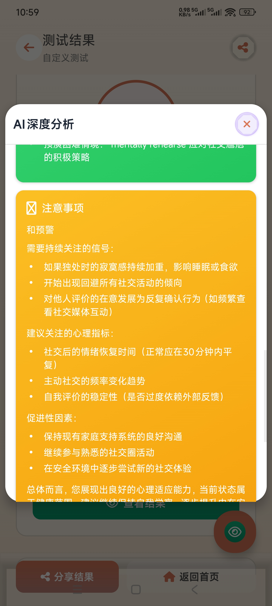

[中文](./readme_cn.md) | [English](./README.md)

## 项目介绍
一个基于AI的探索内心、了解自我的App。支持安卓和IOS。

## 开发说明
本项目几乎全部使用 **KAT-Coder-Pro V1** 模型进行开发.

### 应用演示视频

观看我们的应用演示视频：

<iframe src="//player.bilibili.com/player.html?isOutside=true&aid=115531768205559&bvid=BV12LkyBuEHh&cid=33924710953&p=1" scrolling="no" border="0" frameborder="no" framespacing="0" allowfullscreen="true"></iframe>

### 界面展示

以下是我们应用的界面截图展示：

<table>
  <tr>
    <td></td>
    <td></td>
    <td></td>
    <td></td>
    <td></td>
  </tr>
  <tr>
    <td align="center">界面1</td>
    <td align="center">界面2</td>
    <td align="center">界面3</td>
    <td align="center">界面4</td>
    <td align="center">界面5</td>
  </tr>
  <tr>
    <td></td>
    <td></td>
    <td></td>
    <td></td>
    <td></td>
  </tr>
  <tr>
    <td align="center">界面6</td>
    <td align="center">界面7</td>
    <td align="center">界面8</td>
    <td align="center">界面9</td>
    <td align="center">界面10</td>
  </tr>
  <tr>
    <td></td>
    <td></td>
    <td></td>
    <td></td>
    <td></td>
  </tr>
  <tr>
    <td align="center">界面11</td>
    <td align="center">界面12</td>
    <td align="center">界面13</td>
    <td align="center">界面14</td>
    <td align="center">界面15</td>
  </tr>
</table>

### 使用**KAT-Coder-Pro V1**开发历程

通过自然对话的方式使用**KAT-Coder-Pro V1**完成了整个项目。

#### 📋 PRD设计
向AI描述了心理健康应用的想法，AI梳理了完整的产品框架，设计了用户流程和功能模块，并提醒注意数据隐私问题。
[查看详细PRD文档](./design/PRD.md)

#### 🎨 UI设计
提出简洁温馨的界面风格需求，AI设计了从首页到测试页面的完整UI，特别是结果页面的渐变背景和图表展示，让心理分析结果更直观。
[查看UI设计示例](./design/ui)

#### 🏗️ 架构设计
提出跨平台支持需求，AI推荐了React Native + Expo方案，设计了清晰的MVC架构，并规划了SQLite数据库结构。
[查看架构设计文档](./design/architect.md)

### 试题设计

[查看试卷设计文档](./design/试卷设计.md)

#### 💻 代码开发
通过对话式指令让AI逐步实现所有功能，从页面组件到路由系统，再到数据库操作和AI接口集成，过程中AI主动优化了代码质量和错误处理。
感觉AI能**自动**完成80%的代码，剩下的20%，还是需要人去纠正，需要描述的很清楚问题是什么，希望AI如何修改，此时，AI才能较好的完成。

### 项目技术栈

#### 前端架构
- **框架**: React Native + Expo
- **路由**: Expo Router (支持文件系统路由)
- **状态管理**: React Context + Hooks
- **类型系统**: TypeScript
- **UI组件**: React Native Elements + 自定义组件

#### 跨平台支持
- **平台**: iOS、Android、Web
- **构建工具**: Expo CLI
- **新架构**: 支持 React Native 新架构 (New Architecture)
- **原生模块**: 支持原生功能集成 (相机、相册、震动等)

#### 数据存储
- **本地数据库**: SQLite (Expo SQLite)
- **数据持久化**: AsyncStorage
- **ORM**: TypeORM (轻量级对象关系映射)
- **数据模型**: 用户数据、测试记录、答题历史

#### AI服务集成
- **AI模型**: KwaiKAT (万擎API)
- **服务架构**: RESTful API 调用
- **功能**: 心理分析、测试生成、个性化建议
- **数据格式**: JSON 标准化交互

#### 开发工具
- **代码规范**: ESLint + TypeScript ESLint
- **测试框架**: Jest + Expo Testing Library
- **包管理**: npm
- **环境配置**: Expo 环境变量管理
